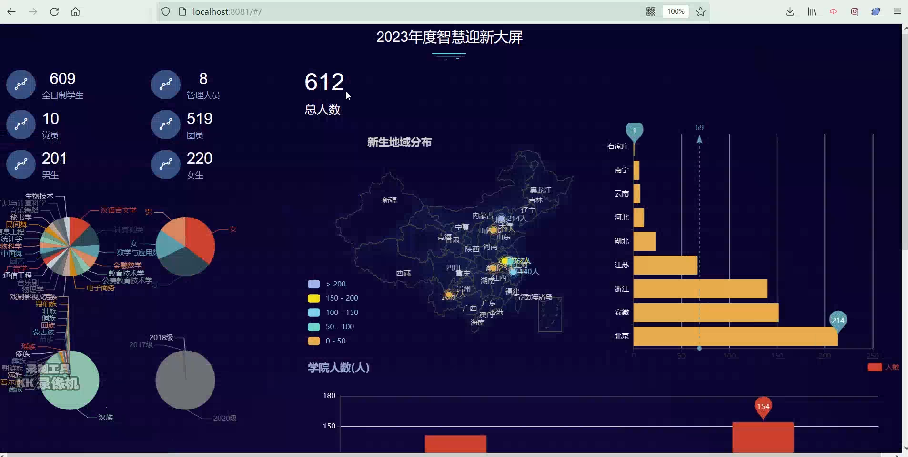
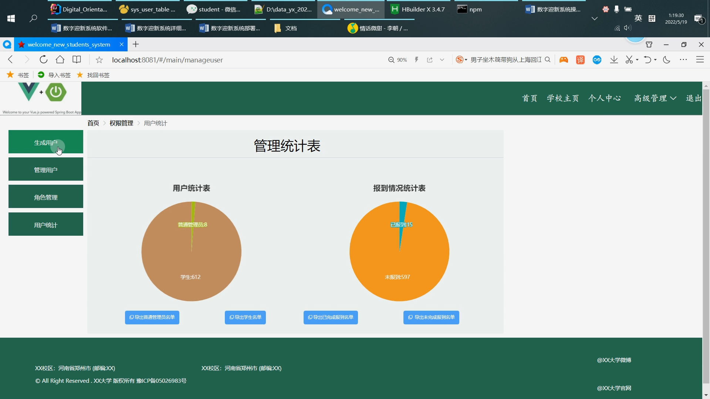

# 计算机毕业设计之Spark+SpringBoot+Vue.js数字迎新系统小程序App 新生报到系统小程序App 新生缴费系统小程序App 大数据毕业设计

## 要求
### 源码有偿！一套(论文 PPT 源码+sql脚本)

https://www.bilibili.com/video/BV1JS4y1v7ik?spm_id_from=333.999.0.0

https://www.bilibili.com/video/BV1ZY4y1z7Ek?spm_id_from=333.999.0.0

### 

### 加好友前帮忙start一下，并备注github有偿获取源码
### 我的QQ号是2877135669 或者 1679232425
### 加qq好友说明（被部分 网友整得心力交瘁）：
    1.加好友务必按照格式备注
    2.避免浪费各自的时间！
    3.当“客服”不容易，repo 主是体面人，不爆粗，性格好，文明人。

# 完整资料

## 开发技术
前端：vue.js echarts

后端：springboot+mybatis

数据分析：Spark

数据库：mysql

# 整体架构设计

大屏统计端

API接口端

小程序端

用户门户系统

后台管理系统

# 创新点

Excel导入导出、大屏Spark大数据统计、多角色登录、前后端分离、JavaMail、移动端

 

 

# 运行截图

# 运行视频(B站)

https://www.bilibili.com/video/BV1JS4y1v7ik?spm_id_from=333.999.0.0

https://www.bilibili.com/video/BV1ZY4y1z7Ek?spm_id_from=333.999.0.0

